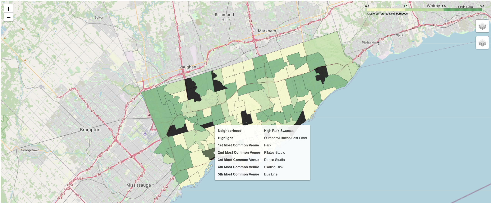

# explore_toronto

__[Refer to Notebook](https://dataplatform.cloud.ibm.com/analytics/notebooks/v2/874dca4a-03fc-40ec-bb0f-699cbb3ae565/view?access_token=60d21e6a7c288df097aa274c59e997af96c5ae93628cf0372eafba599ef76244)__ to interact with the map and download the dataset

__Problem:__ Are you moving to Toronto and wondering in which neighborhood to settle, what do neighborhoods have in common and how to they compare based on their trending venues?
Don't look any further, in this report, Toronto neighborhoods are clustered for a better understanding on how to approach making this decision.

__Data Source:__
- [Canada's open data catalog](https://www.toronto.ca/ext/open_data/catalog/data_set_files/2016_neighbourhood_profiles.csv) for data on 140 different neighborhoods in Toronto 
- Geocoders API for Toronto neighboorhoods' geo-coordinates
- [Foursquare API](https://foursquare.com) for top 10 trending venues in each neighborhood

